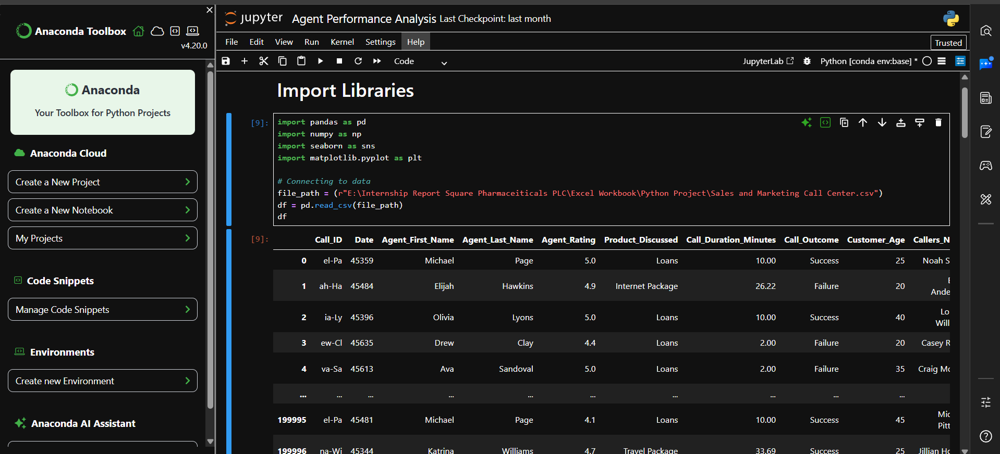
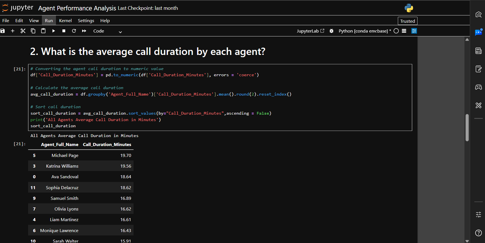
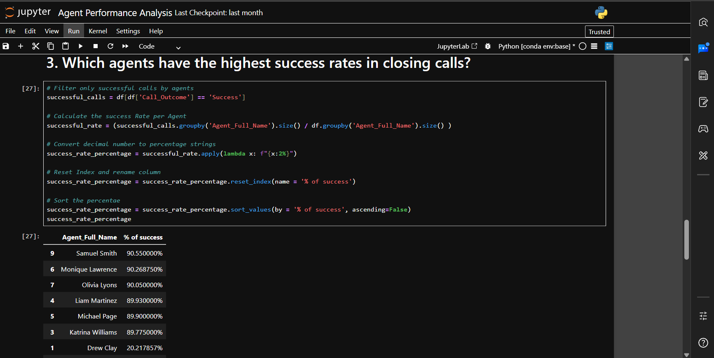
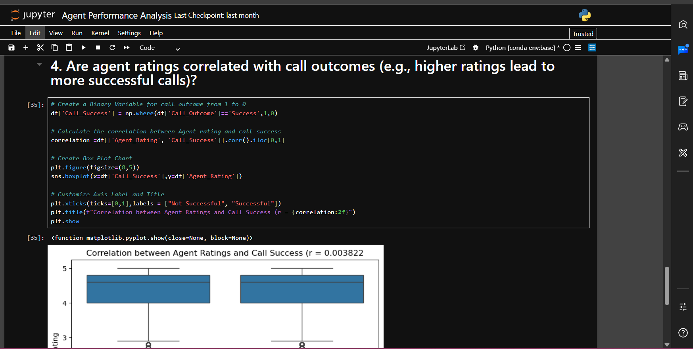
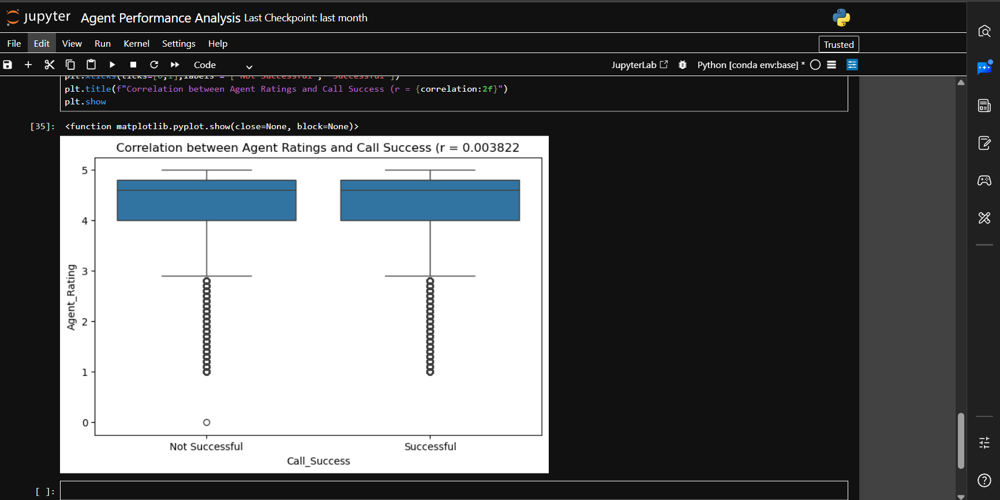

# Data-Cleaning-Automation-Using-Python
## 📌 Project Overview

This project analyzes call center agent performance using Python by evaluating key metrics such as agent ratings, average call duration, call success rate, and the relationship between agent ratings and successful calls.

## 🛠️ Tools & Technologies

* Python
* Jupyter Notebook
* Pandas
* NumPy
* Matplotlib
* Seaborn

## 📊 Analysis Performed

### Data Loading & Preparation

* Imported the CSV dataset.
* Combined agent names and converted important columns into numeric format.

---

### KPI 1: Top Performing Agents Based on Rating

Identified agents with the highest rating score (5.0).

---

### KPI 2: Average Call Duration Analysis

Calculated and ranked the average call duration of each agent.

---

### KPI 3: Agent Success Rate Analysis

Measured the percentage of successful calls handled by each agent.

---

### KPI 4: Correlation Between Rating & Call Success

Analyzed the relationship between agent ratings and successful call outcomes using a correlation analysis and box plot.

---

## 💡 Key Business Insights

* Identify top-performing agents.
* Evaluate agent efficiency.
* Compare call success performance.
* Support data-driven decision-making.

## 👨‍💻 Author

**Shah Abesh Rahman**
BBA Student, University of Dhaka
Interested in Business Analytics, Data Analytics & Process Automation.

